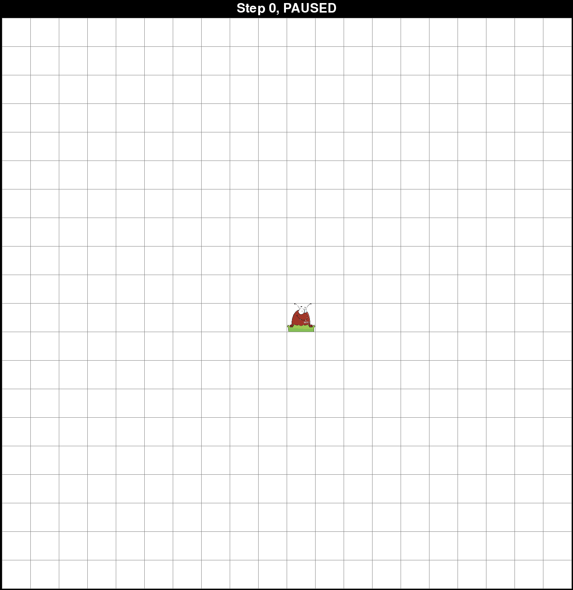
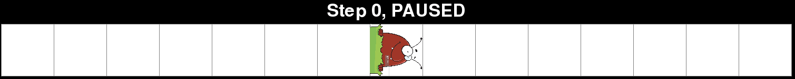
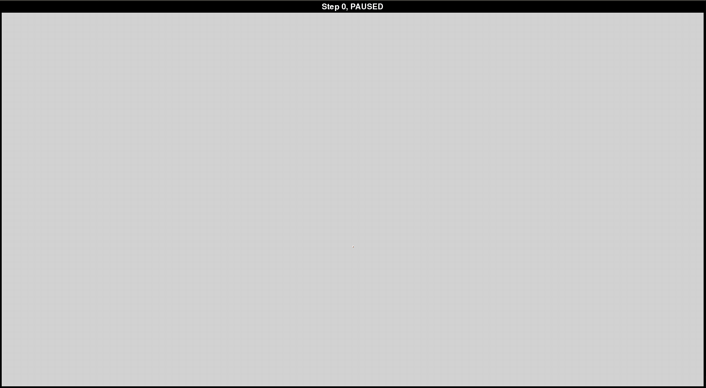
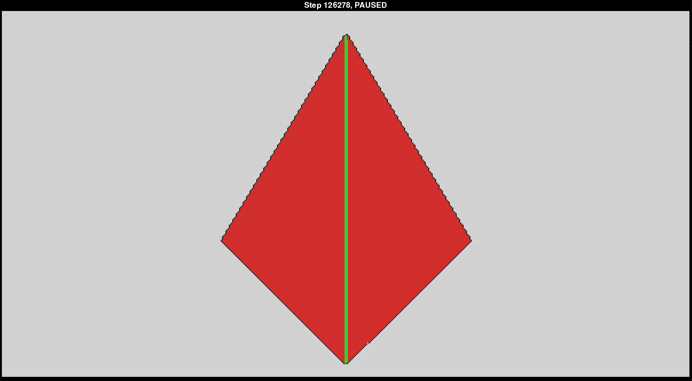
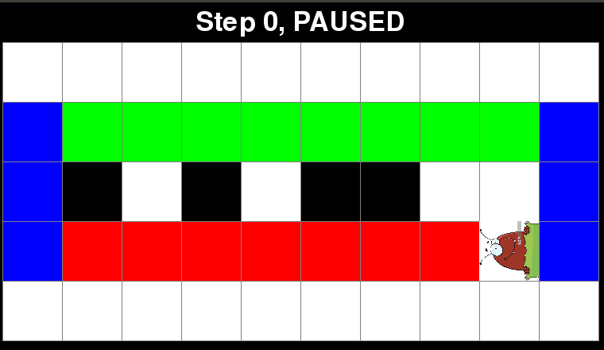
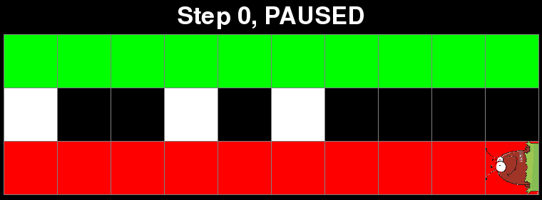
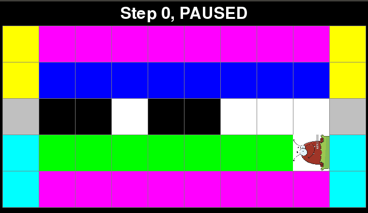

# Graphing Fleas

Simulates the movement of fleas on a 2-dimensional grid. The fleas rotate depending on the color of the square they are currently on. The squares change color when fleas land on them.

Note: Requires Python 3.

## Authors

Kyle Swanson, Magdalen Dobson, Thomas Sturm

## Installation

```
git clone https://github.com/swansonk14/graphing_fleas.git
pip install -r requirements.txt
```

## Running the simulation

To run the simulation, simply run:

```
python main.py
```

The simulation can be paused and resumed by pressing the space bar.

The default simulates [Langton's Ant](https://en.wikipedia.org/wiki/Langton%27s_ant).



## Arguments

A number of optional arguments can be passed, including:

* `num_rows` - The number of rows in the grid.
* `num_cols` - The number of columns in the grid.
* `width` - The width (in pixels) of each square in the grid.
* `height` - The height (in pixels) of each square in the grid.
* `flea_name` - The name of the type of flea to simulate. Different fleas follow different rules.
* `num_fleas` - The number of fleas to simulate.
* `flea_rows` - The initial rows of the fleas. None to start in the center vertically. Unspecified fleas will be placed randomly (except for the first, which will be placed in the center).
* `flea_cols` - The initial columns of the fleas. None to start in the center horizontally. Unspecified fleas will be placed randomly (except for the first, which will be placed in the center).
* `init_directions` - Initial directions of the fleas. Unspecified fleas will start facing up.
* `visited` - Add this flag to mark an X in squares which have been visited.
* `display_frequency` - The number of steps between each update of the board display. -1 to update on command by pressing the "d" key. May be in scientific notation (ex. 1e5).
* `print_frequency` - The number of steps between each printing of the step number to the terminal. May be in scientific notation (ex. 1e5).
* `delay` - The number of milliseconds of delay between each step of the simulation.
* `pause` - Add this flag to start the game in the paused state.

Additionally, whenever the game is paused, the squares may be clicked to change their color. A left click advances to the next color while a right click reverts to the previous color.

## Examples

### RRLLLRLLLRRR

Langton's Ant with 12 colors. Rotations left or right correspond to the rule RRLLLRLLLRRR for the 12 colors.

```
python main.py --num_rows 300 --num_cols 600 --width 5 --height 5 --flea_name triangle_flea --num_fleas 1 --display_frequency 5000 --flea_rows 30
```


### 1D visit

A one-dimensional flea visiting all squares, 2 colors.

```
python main.py --flea_name 1d_visit --delay 50 --num_rows 1 --num_cols 15 --width 100 --height 100
```



### 2D visit

A two-dimensional flea visiting all squares, 3 colors.

```
python main.py --flea_name 2d_visit --num_rows 320 --num_cols 600 --width 5 --height 5 --display_frequency 7000 --flea_rows 200
```



**Remark:** Below is an image of the same flea on squares with 4 colors instead of 3. All the white squares have not been touched by the flea, all the black squares have been touched once, the red squares twice, and the green squares three or more times. The pattern below indicates that the flea works by circling around the border of the diamond and traveling up and down the green highway but never again touching any of the red squares.



### Bit flipper

A flea which flips the bits of a binary number.

```
python main.py --config configs/bit_flipper.json
```



### Add one

A flea which adds 1 to a binary number.

```
python main.py --config configs/add_one.json
```



### Two's complement

A flea which computes the two's complement of a binary number.

```
python main.py --config configs/twos_complement.json
```


