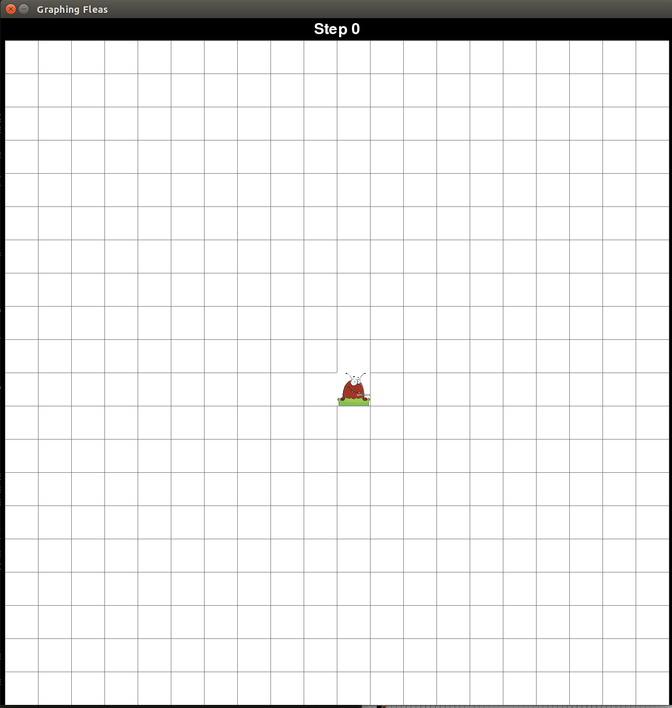
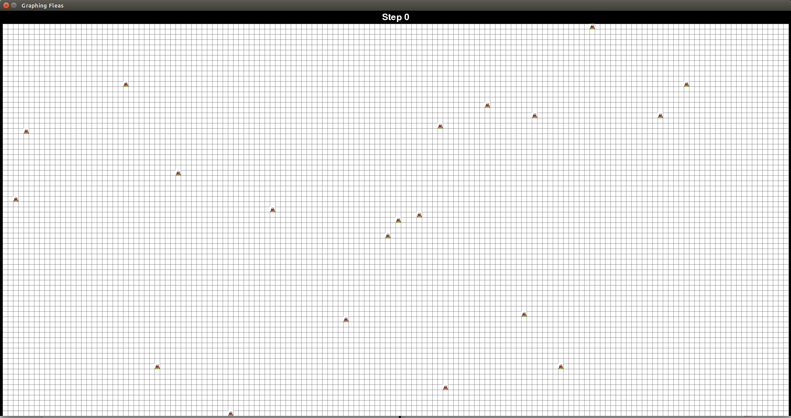
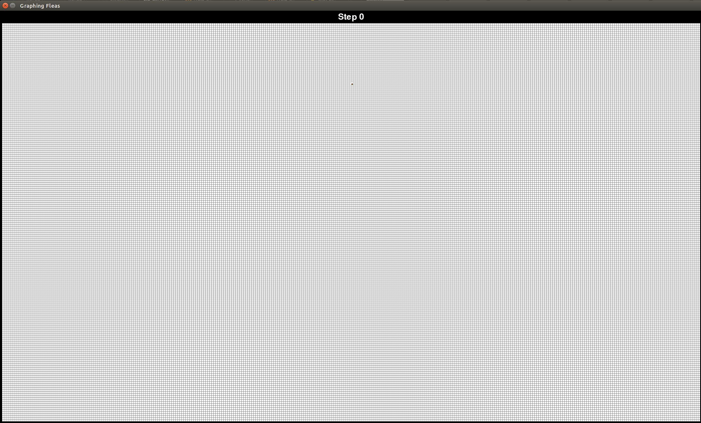

# Graphing Fleas

Simulates the movement of fleas on a 2-dimensional grid. The fleas rotate depending on the color of the square they are currently on. The squares change color when fleas land on them.

Note: Requires Python 3.

## Installation

```
git clone https://github.com/swansonk14/graphing_fleas.git
pip install -r requirements.txt
```

## Running the simulation

To run the simulation, simply run:

```
python main.py
```

The simulation can be paused and resumed by pressing the space bar.

The default simulates [Langton's Ant](https://en.wikipedia.org/wiki/Langton%27s_ant).



## Arguments

A number of optional arguments can be passed, including:

* `num_rows` - The number of rows in the grid.
* `num_cols` - The number of columns in the grid.
* `width` - The width (in pixels) of each square in the grid.
* `height` - The height (in pixels) of each square in the grid.
* `flea_name` - The name of the type of flea to simulate. Different fleas follow different rules.
* `flea_row` - The initial row of the first flea. -1 to start in the center vertically.
* `flea_col` - The initial column of the first flea. -1 to start in the center horizontally.
* `num_fleas` - The number of fleas to simulate.
* `square_name` - The name of the type of square to use. Different squares follow different rules.
* `num_colors` - The number of colors each square can take on.
* `display_frequency` - The number of steps between each update of the board display. -1 to update on command by pressing the "d" key.
* `delay` - The number of milliseconds of delay between each step of the simulation.

## Examples

Langton's Ant with 5 colors.

```
python main.py --num_rows 75 --num_cols 150 --width 20 --height 20 --flea_name langtons_flea --num_fleas 20 --num_colors 5 --display_frequency 1 --delay 0
```



RRLLLRLLLRRR version of Langton's Ant.

```
python main.py --num_rows 300 --num_cols 600 --width 5 --height 5 --flea_name triangle_flea --num_fleas 1 --num_colors 12 --display_frequency 5000 --flea_row 30
```



## Authors
Kyle Swanson, Magdalen Dobson, Thomas Sturm
