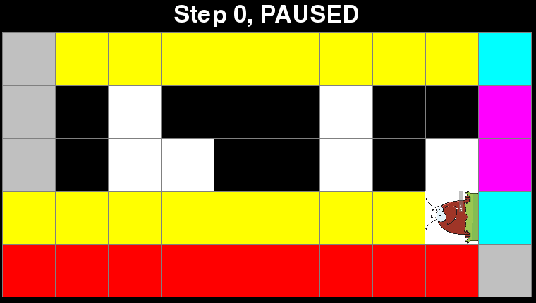

# Graphing Fleas

Simulates the movement of fleas on a 2-dimensional grid. The fleas rotate depending on the color of the square they are currently on. The squares change color when fleas land on them.

## Authors

Code written by Kyle Swanson

Additional mathematical insight from Magdalen Dobson and Thomas Sturm

## Installation

Note: Requires Python 3.

```
git clone https://github.com/swansonk14/graphing_fleas.git
pip install -r requirements.txt
```

## Running the simulation

The simulation can be run with:

```
python main.py
```

The default simulates [Langton's Ant](https://en.wikipedia.org/wiki/Langton%27s_ant).


## Arguments

A number of optional arguments can be passed, including:

* `num_rows` - The number of rows in the grid.
* `num_cols` - The number of columns in the grid.
* `width` - The width (in pixels) of each square in the grid.
* `height` - The height (in pixels) of each square in the grid.
* `flea_name` - The name of the type of flea to simulate. Different fleas follow different rules.
* `num_fleas` - The number of fleas to simulate.
* `flea_rows` - The initial rows of the fleas. None to start in the center vertically. Unspecified fleas will be placed randomly (except for the first, which will be placed in the center).
* `flea_cols` - The initial columns of the fleas. None to start in the center horizontally. Unspecified fleas will be placed randomly (except for the first, which will be placed in the center).
* `init_directions` - Initial directions of the fleas. Unspecified fleas will start facing up.
* `image` - The name of the image file in the `images` directory to use as the flea image. Current options: "flea.png" (default), "arrow.png".
* `visited` - Add this flag to mark an X in squares which have been visited.
* `coordinates` - Add this flag to display the coordinates of the squares. Coordinates are relative to the first flea's initial location, which is considered the origin (0,0).
* `display_frequency` - The number of steps between each update of the board display. -1 to update on command by pressing the "d" key. May be in scientific notation (ex. 1e5).
* `print_frequency` - The number of steps between each printing of the step number to the terminal. May be in scientific notation (ex. 1e5).
* `delay` - The number of milliseconds of delay between each step of the simulation.
* `pause` - Add this flag to start the game in the paused state.

## Commands

Press the space bar to pause and resume the game.

While the game is paused, the squares may be clicked to change their color. A left click advances to the next color while a right click reverts to the previous color.

While the game is paused, pressing the right arrow key will advance the simulation by a single step.

If the game is running with a display frequency not equal to 1 (meaning the display is not updated on every step), the display may be manually updated at any point by pressing the "d" key.

## Simulation Examples

### Triangle

Langton's Ant with 12 colors, which builds an infinitely growing triangle. Rotations left or right correspond to the rules RRLLLRLLLRRR for the 12 colors.

```
python main.py --flea_name triangle --num_rows 300 --num_cols 600 --width 5 --height 5 --flea_rows 30 --display_frequency 5000
```


### 1D visit

A one-dimensional flea visiting all squares on a grid with 2 colors.

```
python main.py --flea_name 1d_visit --num_rows 1 --num_cols 15 --width 100 --height 100 --delay 50
```


### 2D visit

A two-dimensional flea visiting all squares on a grid with 3 colors.

```
python main.py --flea_name 2d_visit --num_rows 320 --num_cols 600 --width 5 --height 5 --flea_rows 200 --display_frequency 7000 
```

### Bit flipper

A flea which flips the bits of a binary number.

```
python main.py --config configs/bit_flipper.json
```


### Add one

A flea which adds 1 to a binary number.

```
python main.py --config configs/add_one.json
```


### Two's complement

A flea which computes the two's complement of a binary number. Computing two's complement involves first flipping the bits and then adding one. Note: In the end result, red represents 0 and black represents 1.

```
python main.py --config configs/twos_complement.json
```


## Adder

A flea which adds two binary numbers. In this example, 187 + 154 = 341, or in binary,

```
  10111011
 +10011010
=101010101
```

Note: In the end result, red represents 0 and green represents 1.

```
python main.py --config configs/adder.json
```


