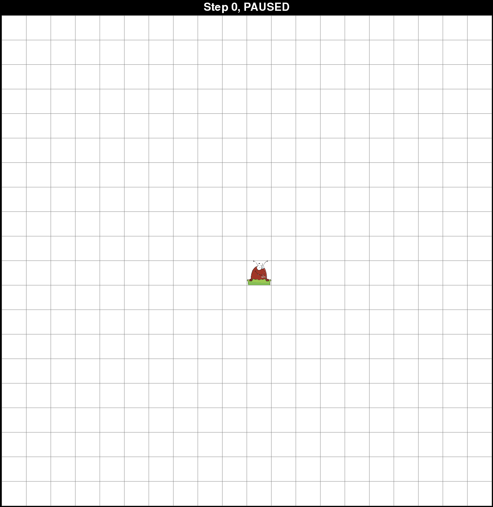
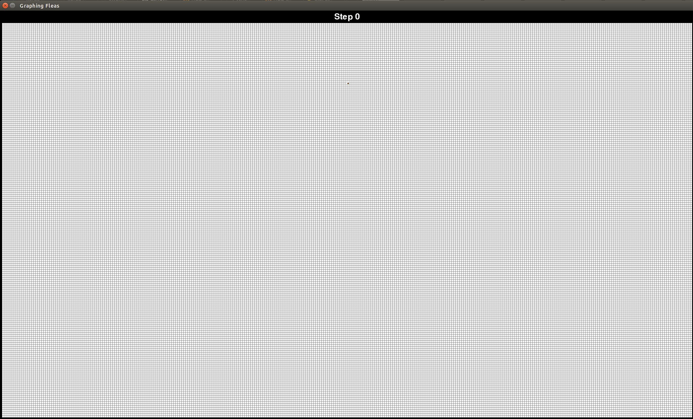
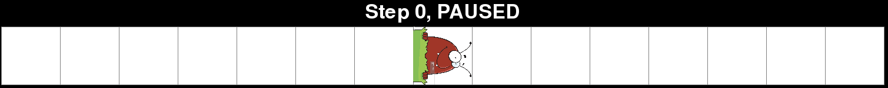
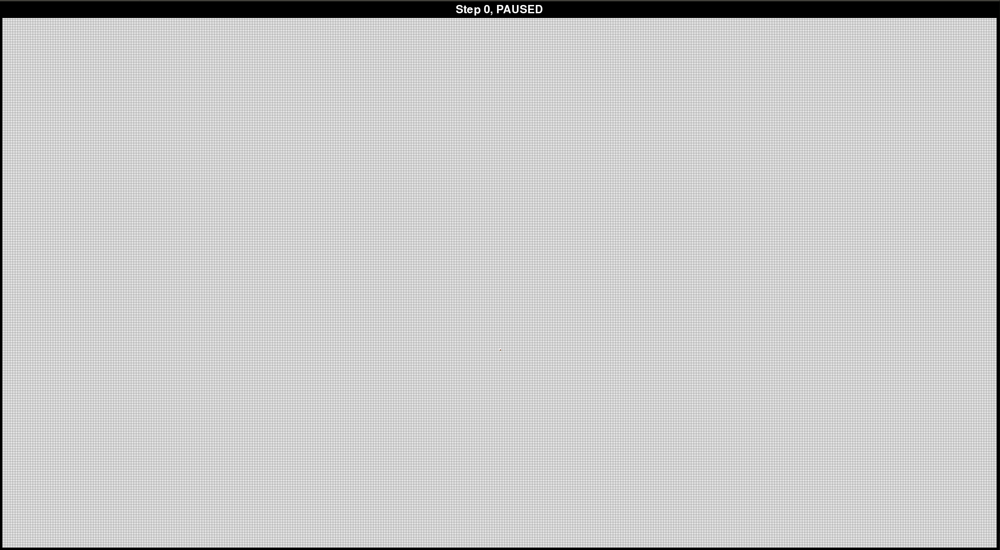
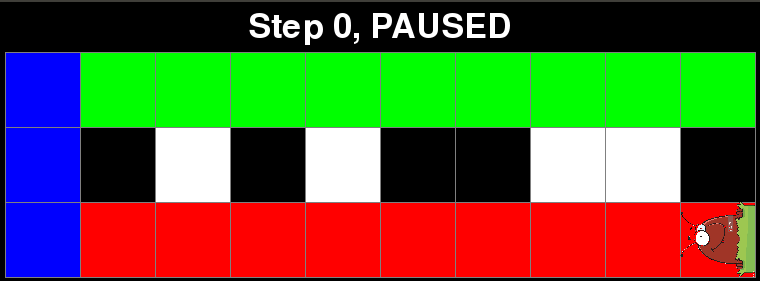
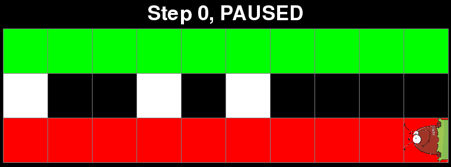
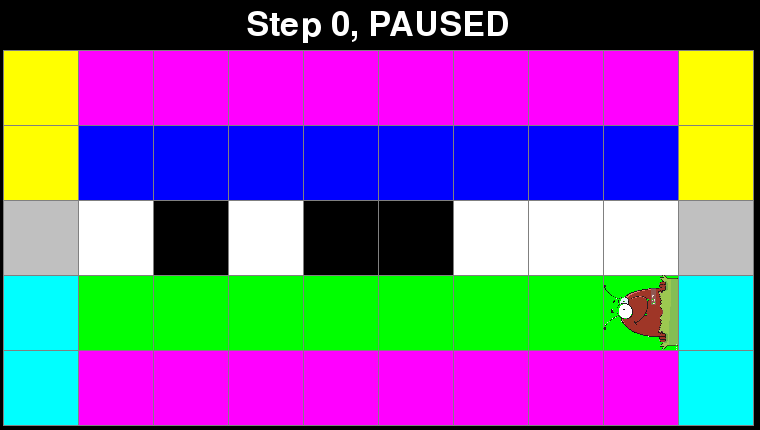
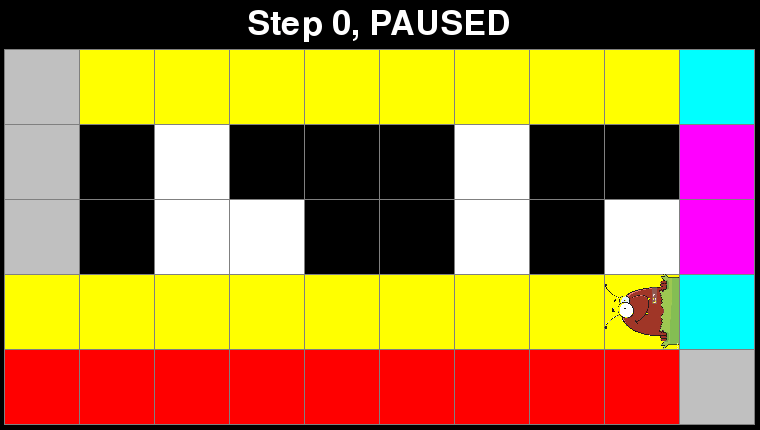

# Graphing Fleas

The Graphing Fleas Simulator simulates the movement of fleas on a grid in the manner of [Langton's Ant](https://en.wikipedia.org/wiki/Langton%27s_ant), a 2-dimensional [universal Turing Machine](https://en.wikipedia.org/wiki/Universal_Turing_machine). As with Langton's Ant, each flea rotates depending on the color of the grid square it is currently on, and the colors of the grid squares change when the flea visits them. However, unlike Langton's Ant, which simulates a single ant on a grid with just two colors, the Graphing Fleas Simulator can simulate an arbitrary number of fleas and colors and provides significant flexibility when designing the rules which govern how the squares change colors and how the fleas rotate.

## Authors

Code written by Kyle Swanson

Additional mathematical insight from Magdalen Dobson and Thomas Sturm

## Table of Contents

* [Installation](#installation)
* [Simulating fleas](#simulating-fleas)
    * [Running the simulation](#running-the-simulation)
    * [Arguments](#arguments)
    * [Commands](#commands)
    * [Designing custom fleas](#designing-custom-fleas)
    * [Examples](#examples)
        * [Triangle](#triangle)
        * [1D visit](#1d-visit)
        * [2D visit](#2d-visit)
* [Computing with fleas](#computing-with-fleas)
    * [Running a computation](#running-a-computation)
    * [Examples](#examples-1)
        * [Bit flip](#bit-flip)
        * [Add one](#add-one)
        * [Two's complement](#twos-complement)
        * [Add](#add)
* [References](#references)

## Installation

```
git clone https://github.com/swansonk14/graphing_fleas.git
pip install -r requirements.txt
```

## Simulating fleas


### Running the simulation

The simulator can be run with:

```
python main.py
```

The default simulation is [Langton's Ant](https://en.wikipedia.org/wiki/Langton%27s_ant), which is a single flea on a grid with two colors: black and white. The flea rotates 90° clockwise on a white square and 90° counterclockwise on a black square.



### Arguments

A number of optional arguments can be passed in, including:

* `config` - The path to a JSON file containing an initial board configuration and some or all of the following arguments.
* `num_rows` - The number of rows in the grid.
* `num_cols` - The number of columns in the grid.
* `width` - The width (in pixels) of each square in the grid.
* `height` - The height (in pixels) of each square in the grid.
* `flea_name` - The name of the type of flea to simulate.
* `num_fleas` - The number of fleas to simulate.
* `flea_rows` - The initial rows of the fleas. Fleas with unspecified rows will be placed in random rows (except for the first flea, which will be placed in the center vertically).
* `flea_cols` - The initial columns of the fleas. Fleas with unspecified columns will be placed in random columns (except for the first flea, which will be placed in the center horizontally).
* `init_directions` - The initial directions of the fleas. Fleas with unspecified initial directions will start facing up.
* `image` - The name of the image file in the `images` directory to use as the flea image. Current options: "flea.png" (default), "arrow.png".
* `visited` - Add this flag to mark an X in squares which have been visited by a flea.
* `coordinates` - Add this flag to display the coordinates of the squares. Coordinates are relative to the first flea's initial location, which is (0,0).
* `hide_grid` - Add this flag to hide the grid lines between squares on the grid. Useful for large grids.
* `display_frequency` - The number of steps between each update of the board display. Use -1 to only update on command (by pressing the "d" key). This number may be in scientific notation (ex. 1e5).
* `print_frequency` - The number of steps between each printing of the step number to the terminal. This number may be in scientific notation (ex. 1e5).
* `delay` - The number of milliseconds of delay between each step of the simulation.
* `pause` - Add this flag to start the game in the paused state.

### Commands

Press the space bar to pause and resume the game.

While the game is paused, the squares may be clicked to change their color. A left click advances to the next color while a right click reverts to the previous color. Additionally, pressing the right arrow key will advance the simulation by a single step.

If the game is running with a display frequency not equal to 1 (meaning the display is not updated on every step), the display may be manually updated at any point by pressing the "d" key.

### Designing custom fleas

Custom fleas can be defined in `flea.py`. All custom fleas should be classes which subclass the `Flea` class. Furthermore, the decorator `RegisterFlea('<flea_name>')` should be added to the class, which will make it possible to simulate this flea by running `main.py` with the `--flea_name <flea_name>` flag. All custom fleas must define the `num_colors` property and the `rotate` method. The `num_colors` property is the number of colors that squares on the grid can take on. The `rotate` method rotates the flea depending on the color of the square it is currently on.

By default, the square colors cycle and loop back to the beginning (ex. `0 --> 1 --> 2 --> 0`). However, the `cycle_size` property can be defined to indicate the size of the color cycle. For instance, if `num_colors = 3` and `cycle_size = 2`, then the colors would progress as follows: `0 --> 1 --> 2 --> 1` with the size 2 cycle of `1 --> 2 --> 1` at the end. For even more fine grained control of how the square colors change, the `color_map` property can be defined, which is a dictionary which maps each color to the next color. See `flea.py` for code examples.

### Examples

#### Triangle

Langton's Ant with 12 colors, which builds an infinitely growing triangle. Rotations left or right correspond to the rules RRLLLRLLLRRR for the 12 colors.

```
python main.py --flea_name triangle --num_rows 300 --num_cols 600 --width 5 --height 5 --flea_rows 30 --display_frequency 5000
```



#### 1D visit

A one-dimensional flea visiting all squares on a grid with 2 colors.

```
python main.py --flea_name 1d_visit --num_rows 1 --num_cols 15 --width 100 --height 100 --delay 50
```



#### 2D visit

A two-dimensional flea visiting all squares on a grid with 3 colors.

```
python main.py --flea_name 2d_visit --num_rows 320 --num_cols 600 --width 5 --height 5 --flea_rows 200 --display_frequency 7000 
```



## Computing with fleas

Certain computations can be peformed by fleas, given the right set of colors and rules. Additionally, the board must pre-set the colors of certain squares to provide the flea with input in the appropriate format. The `compute.py` script automatically pre-sets the board for several different computations when given input(s) and then simulates the computation.

### Running a computation

To perform a computation, run:

```
python compute.py --compute <compute_type> --inputs <list_of_inputs>
```

Currently the following computation types are available:

* `bit_flip` - Flips the bits of an integer. Takes one input.
* `add_one` - Adds one to an integer. Takes one input.
* `twos_complement` - Computes the [two's complement](https://en.wikipedia.org/wiki/Two%27s_complement) of an integer. Takes one input.
* `add` - Adds two integers. Takes two inputs.

Additionally, the optional flag `--base` may be provided to indicate the base in which the `inputs` are being provided. The default is base 2.

The width and height of each square can be set with `--width` and `--height`.

### Examples

#### Bit flip

A flea which flips the bits of an integer.

```
python compute.py --compute bit_flip --inputs 101011001
```



#### Add one

A flea which adds 1 to an integer.

```
python compute.py --compute add_one --inputs 0110101111
```



#### Two's complement

A flea which computes the two's complement of an integer. Computing the two's complement involves first flipping the bits and then adding one.

Note: In the end result, red represents 0 and black represents 1.

```
python compute.py --compute twos_complement --inputs 01011000
```



#### Add

A flea which adds two binary numbers. In this example, 187 + 154 = 341, or in binary:

```
  10111011
 +10011010
=101010101
```

Note: In the end result, red represents 0 and green represents 1.

```
python compute.py --compute add --base 10 --inputs 187 154
```



## References

This simulator was inspired by the Graphing Fleas project from the MIT class [18.821 - Project Laboratory in Mathematics](http://math.mit.edu/classes/18.821/), taught by Haynes Miller in spring 2018.
