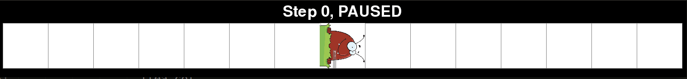

# Graphing Fleas

Simulates the movement of fleas on a 2-dimensional grid. The fleas rotate depending on the color of the square they are currently on. The squares change color when fleas land on them.

Note: Requires Python 3.

## Installation

```
git clone https://github.com/swansonk14/graphing_fleas.git
pip install -r requirements.txt
```

## Running the simulation

To run the simulation, simply run:

```
python main.py
```

The simulation can be paused and resumed by pressing the space bar.

The default simulates [Langton's Ant](https://en.wikipedia.org/wiki/Langton%27s_ant).


## Arguments

A number of optional arguments can be passed, including:

* `num_rows` - The number of rows in the grid.
* `num_cols` - The number of columns in the grid.
* `width` - The width (in pixels) of each square in the grid.
* `height` - The height (in pixels) of each square in the grid.
* `flea_name` - The name of the type of flea to simulate. Different fleas follow different rules.
* `flea_row` - The initial row of the first flea. -1 to start in the center vertically.
* `flea_col` - The initial column of the first flea. -1 to start in the center horizontally.
* `num_fleas` - The number of fleas to simulate.
* `square_name` - The name of the type of square to use. Different squares follow different rules.
* `num_colors` - The number of colors each square can take on.
* `display_frequency` - The number of steps between each update of the board display. -1 to update on command by pressing the "d" key.
* `delay` - The number of milliseconds of delay between each step of the simulation.
* `pause` - Add this flag to start the game in a paused state.

## Examples

### Multi-color Langton's Ant

Langton's Ant on squares with 5 colors.

```
python main.py --num_rows 75 --num_cols 150 --width 20 --height 20 --flea_name langtons_flea --num_fleas 20 --num_colors 5
```


### RRLLLRLLLRRR

Langton's Ant with 12 colors. Rotations left or right correspond to the rule RRLLLRLLLRRR for the 12 colors.

```
python main.py --num_rows 300 --num_cols 600 --width 5 --height 5 --flea_name triangle_flea --num_fleas 1 --num_colors 12 --display_frequency 5000 --flea_row 30
```


### 1D visit flea

A one-dimensional flea visiting all squares, 2 colors.

```
python main.py --flea_name 1d_visit_flea --delay 50 --num_rows 1 --num_cols 15 --width 100 --height 100 --square_name end_color_square
```



### 2D visit flea

A two-dimensional flea visiting all squares, 3 colors.

```
python main.py --flea_name 2d_visit_flea --num_rows 320 --num_cols 600 --width 5 --height 5 --square_name end_color_square --num_colors 3 --display_frequency 7000 --flea_row 200
```


Remark: Below is an image of the same flea on squares with 4 colors instead of 3. All the white squares have not been touched by the flea, all the black squares have been touched once, the red squares twice, and the green squares three or more times. The pattern below indicates that the flea works by circling around the border of the diamond and traveling up and down the green highway but never again touching any of the red squares.


## Authors
Kyle Swanson, Magdalen Dobson, Thomas Sturm
